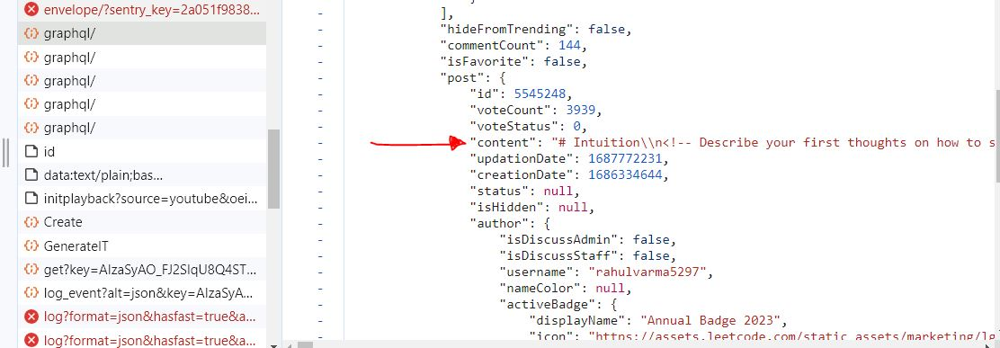
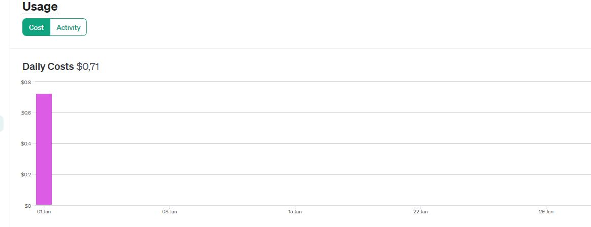
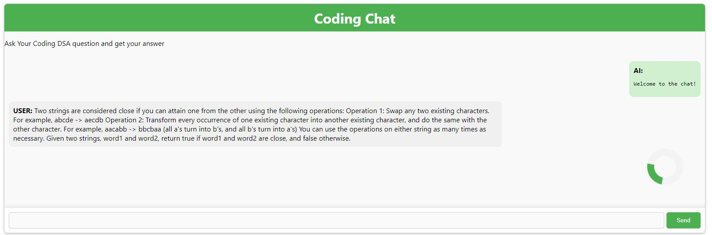
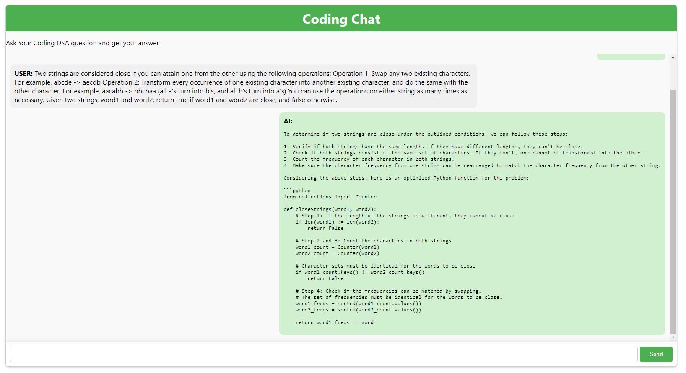

# LLM Fine Tuning


## Table of Contents
- [Context](#context)
- [Attempted Solution](#attempted-solution)
- [The Idea](#the-idea)
- [Project Goal](#project-goal)
- [My Work / Research](#my-work--research)
- [Let's Code](#lets-code)
- [Finetuning GPT3.5](#finetuning-gpt35)
- [The App](#the-app)


## Context
chatGPT is adept at solving D&A-type problems, but struggles with the more challenging ones. For example, the latest hard problem from LeetCode:


## Attempted Solution
When asked to solve it, the response was incorrect. Here are the images of the attempted solutions:

<div style="display:flex; justify-content:space-between;">
  
  
</div>

## The Idea
The goal is to design a more efficient model for Data Structure and Algorithm (DSA) questions.

## Project Goal
I aim to create a browser extension that provides answers to DSA questions when pasted into it.

---

## My Work / Research

### First step

At first, I thought I'd use a model that had already been made and finetuned on huggingface to see what results could be obtained. 

Unfortunately, I ran into a problem:
**Canceled future for execute_request message before replies were done**

**The Kernel froze when executing code in the active cell or a previous cell. Please check the code in the cell(s) to identify a possible cause of the failure. Click [here](https://aka.ms/vscodeJupyterKernelCrash) for more information. For more information, see Jupyter log.**

In other words: I don't have enough memory to run the model on my computer, even taking the model with the fewest parameters and trying with colab,, the models used 7B of data and are too heavy.


### New idea

Two solutions: pay google colab pro (no thanks), or think again.

On second thought, I found a provider that, I think, hosts the models on their servers, and with the help of an API lets us interact with them and even finetune them. Advantage: Free plan $5

Disadvantage: I invite you to read version1.ipynb to understand that the results weren't convincing.

### Hand to wallet

And if the solution could be found in our dear friend openAI.

  

1,000 tokens is about 750 words

Using ChatGPT, I told him to create a solution for the first 5 leetcode exos and to count the average number of characters, and he came up with 365.75 characters (counting spaces, of course).
we can add the fact that there's a little sentence before talking about the datastructure used and a little sentence after, talking about time and space complexity.

Let's round up the total output to an average of 400 characters.

For the input, it varies according to the statement. If we do as above and take the first 5 leetcode exos, we get : 200 characters on average for input.


If we consider that, on average, one token = 4 characters.

We'll have :

- for input: 200 characters --> 50 tokens
- for output: 400 characters --> 100 tokens
- For training: input + output = 600 characters --> 150 tokens

According to training prices, for GPT-3.5-turbo :

For 
0.0080 = 1000 tokens
1000 raw of data = 150000 tokens

so if I want to enter 1000 examples of exercises, it will cost me: 0.0080 * 150 = 1.2$.

the cost of then testing the model with a few exercises will be lower: if I do fifteen or so tests, it will cost me less than 1000 tokens, i.e. less than $0.008.

The main cost is in training.

NB : after testing, the cost is higher than that because the leetcode problem statement for hard/medium problem are really much longer on average than the easy problems.

### Davinci-002 or GPT-3.5-turbo

> Davinci-002 tends to be better at understanding and generating responses for complex tasks. It has been trained on a wider variety of data and for longer, allowing it to develop a deeper understanding of nuanced prompts.

> GPT-3.5-turbo is designed for more rapid responses and may not perform as well on highly complex tasks.

Code-Related Tasks:

> For generating code and solving programming-related queries, Davinci-002 is typically superior. It's been shown to have a better grasp of syntax and logic required for programming, which would be beneficial for solving hard LeetCode problems.

> While GPT-3.5-turbo can handle code to some extent, it might not be as precise or efficient as Davinci-002 when dealing with more complex or less common problems.


I will go for Davinci-002.

We can see on the OpenAPI doc : "You can also fine-tune a fine-tuned model which is useful if you acquire additional data and don't want to repeat the previous training steps."
If I want to I can fine-tune my model two time, firstly on a small dataset, to see if my expectation of the cost is correct.


### Advice to get better result 

> I recommend testing prompts directly on chatGPT to identify the best ones for solving DSA questions. These prompts can then be used for both asking questions and fine-tuning the model.


## Let's code

For  davinci-002, you can follow the prompt completion pair format used for legacy fine-tuning as shown below :

```json
{"prompt": "<prompt text>", "completion": "<ideal generated text>"}
{"prompt": "<prompt text>", "completion": "<ideal generated text>"}
{"prompt": "<prompt text>", "completion": "<ideal generated text>"}
```


First Step for us :
setup our data.

the prompt needs to contains the exercise and an instruction, like "Write a Python function with good time complexity that solves this problem."


the completion needs to contain the code with format answer ! Using space and \n to respect the indentation. Unfortunately the datasets that can be found on huggingface doesn't contain the formatting that i want https://huggingface.co/datasets?search=leetcode

Let's get the data. As I've decided that the model can already solve almost any easy but less medium and especially hard, I'm going to select recent exos in the medium and hard category.

Steps to follow in my opinion:
1. Create another leetcode account (hoping I won't get an IP ban and lose my leetcode streak 🙏)
2. Emulate the leetcode site with Puppeteer, go to the right exercise (list of exercise ids I've predefined by hand)
3. Go to the solution tab, click on python, and take the first solution
4. Go to the code location and retrieve it

Let's test it out.

UPDATE: actually I found a github link from someone who lists leetcode's graphQL schema while searching on forums and stackoverflow post! Not easy to point out, because Leetcode disabled its introspection feature which will let everybody know all the schem (because It's not safe for a company to expose its graphql schema in production)

I tested several queries, including :
```bash
curl 'https://leetcode.com/graphql'   -H 'Content-Type: application/json' --header 'Referer: https://leetcode.com' --header 'Cookie: LEETCODE_SESSION=your_leetcode_session; csrftoken=your_csrf_token' \  --data-raw '{"query":"query communitySolutions($questionSlug: String!, $skip: Int!, $first: Int!, $query: String, $orderBy: TopicSortingOption, $languageTags: [String!], $topicTags: [String!]) { questionSolutions( filters: {questionSlug: $questionSlug, skip: $skip, first: $first, query: $query, orderBy: $orderBy, languageTags: $languageTags, topicTags: $topicTags} ) { hasDirectResults totalNum solutions { id title commentCount topLevelCommentCount viewCount pinned isFavorite solutionTags { name slug } post { id status voteCount creationDate isHidden author { username isActive nameColor activeBadge { displayName icon } profile { userAvatar reputation } } searchMeta { content contentType commentAuthor { username } replyAuthor { username } highlights } } } }","variables":{"questionSlug":"two-sum","skip":0,"first":1,"orderBy":"hot","languageTags":["python3"],"topicTags":[]}}'
```
where you have to replace your_leetcode_session and your_csrf_token by the values you find in the cookies when you launch a leetcode session. Unfortunately I can't get a good result, I'm stuck with :

``` html
<div id="summary">
  <h1>Forbidden <span>(403)</span></h1>
  <p>CSRF verification failed. Request aborted.</p>
```
before attempting to scrape, I'm going to try to analyze the queries made internally on the leetcode side myself

I go to the first exo "Two Sum" and I see that a request has in response :

```json
{
    "data": {
        "question": {
            "content": "<p>Given an array of integers <code>nums</code>&nbsp;and an integer <code>target</code>, return <em>indices of the two numbers such that they add up to <code>target</code></em>.</p>\n\n<p>You may assume that each input would have <strong><em>exactly</em> one solution</strong>, and you may not use the <em>same</em> element twice.</p>\n\n<p>You can return the answer in any order.</p>\n\n<p>&nbsp;</p>\n<p><strong class=\"example\">Example 1:</strong></p>\n\n<pre>\n<strong>Input:</strong> nums = [2,7,11,15], target = 9\n<strong>Output:</strong> [0,1]\n<strong>Explanation:</strong> Because nums[0] + nums[1] == 9, we return [0, 1].\n</pre>\n\n<p><strong class=\"example\">Example 2:</strong></p>\n\n<pre>\n<strong>Input:</strong> nums = [3,2,4], target = 6\n<strong>Output:</strong> [1,2]\n</pre>\n\n<p><strong class=\"example\">Example 3:</strong></p>\n\n<pre>\n<strong>Input:</strong> nums = [3,3], target = 6\n<strong>Output:</strong> [0,1]\n</pre>\n\n<p>&nbsp;</p>\n<p><strong>Constraints:</strong></p>\n\n<ul>\n\t<li><code>2 &lt;= nums.length &lt;= 10<sup>4</sup></code></li>\n\t<li><code>-10<sup>9</sup> &lt;= nums[i] &lt;= 10<sup>9</sup></code></li>\n\t<li><code>-10<sup>9</sup> &lt;= target &lt;= 10<sup>9</sup></code></li>\n\t<li><strong>Only one valid answer exists.</strong></li>\n</ul>\n\n<p>&nbsp;</p>\n<strong>Follow-up:&nbsp;</strong>Can you come up with an algorithm that is less than <code>O(n<sup>2</sup>)</code><font face=\"monospace\">&nbsp;</font>time complexity?",
            "mysqlSchemas": [],
            "dataSchemas": []
        }
    }
}
```

That's exactly what I want!
So I analyzed the query and these headers, and was able to create a working query (check scrapping.py).

Now I also want a response per exercise!

Looking at the various queries, I found that :
1. When you click on solutions, a query retrieves the various solutions with their ids and tags.
2. When you click on a specific solution, another query is made using the id of the solution and retrieves its content, as shown in the following image:

  

I can therefore retrieve a list of solutions and filter them by taking the first solution (the list of solutions contains tags and I can therefore take the first solution with the python3 tag).

Now that I've got the exercise content and its solution, I just need to do a little formatting to get our jsonl file for the training data.

Then i also create a function to automatically take the title_slug of some free hard problems. Job is done.


Now it's time to finetune the data, check davinci_finetune.ipynb.

Cost of the first finetuning on 50 exercises : 

  

Results: after a few queries I realized that the results were not satisfactory, and after some thought I decided that rather than re-finetuning this model, I would try using gpt-3.5-turbo-1106.


## Finetuning GPT3.5

I have just over 4$ in credit left.
Knowing that the first finetuning cost me 0.71$ for 49 exercises with a hit of 0.006 for 1000 tokens, knowing that with gpt-3.5-turbo the cost for 1000 tokens is 0.0080 this will cost me :
0.71/0.006 * 0.008 or about $0.95. I can therefore afford to multiply the number of training data by 3. 


Unlike davinci-002, the data must be formatted as follows for my case:

```json 
{
  "messages": [
    {
      "role": "user",
      "content": "Write an optimized Python function to solve the following problem: [Problem Statement]"
    },
    {
      "role": "assistant",
      "content": "[Python Solution]"
    }
  ]
}
{
  "messages": [
    {
      "role": "user",
      "content": "Write an optimized Python function to solve the following problem: [Problem Statement]"
    },
    {
      "role": "assistant",
      "content": "[Python Solution]"
    }
  ]
}
```
This format is crucial for the model to understand each pair as a separate conversation or interaction
So I'm going to modify my scrapping.py file to get the right results

After some modification I got the dataGPT.jsonl, so I can send the data file and start to finetune gpt-3.5-turbo-1106.

The tests are disappointing, the generated code doesn't solve a random medium problem, and there are syntax errors in the proposed code...


## The App

The application has a few peculiarities:

- I chose to use either my finetuned model or gpt4 (on the backend), and then I decided that the application would use gpt4 as the model so that the results would be more satisfactory.

- I made the choice to have a stateless chat application : each request is processed independently without any knowledge of previous requests. I made this choice because it cost less tokens to do so, and I imagine a case when i want the user to only get the response of the chat, and not continue the conversation any further.

**To use the application :**

- go on the /server folder, create a .env file where you add your OpenAI API Key (you should have one with credits on it), then do npm install, and then node index.js to launch the server
- go on the /app folder and do npm install
- you can reach the application and test it !

Here are some images of what it looks like :





Development choices and ideas for the future:

I use a websocket because it allows for real-time communication between the server and the client. This is essential for a chat application where immediate response and interactivity are key. The websocket ensures that as soon as the server receives a response from the OpenAI API, it is immediately pushed to the client, providing a seamless chat experience.

**Development Choices:**
- **Websocket for Real-Time Communication**: Chosen for its ability to provide a responsive and interactive user experience.
- **React for Frontend**: React's efficient update and rendering system is ideal for the dynamic nature of chat applications.
- **Node.js for Backend**: Node.js is well-suited for handling asynchronous requests and I/O operations, crucial for handling API calls and websocket communication.
- **Stateless Chat Design**: Opted for simplicity and cost-effectiveness in API usage.

**Ideas for the Future:**
- **Stateful Conversations**: Implementing a stateful chat system could provide a more coherent and context-aware conversation experience. This could be an option for users who prefer a continuous chat history.
- **User Authentication**: Implementing user accounts and authentication to personalize the chat experience.
- **Enhanced UI/UX**: Further improvements to the user interface and user experience, such as adding more interactive elements, customization options, or mobile responsiveness.
- **Integration of Additional APIs**: Exploring the integration of other APIs for enhanced functionalities like language translation, image processing, or data analysis.

**How to Contribute:**
- Contributions to the project are welcome! Feel free to fork the repository, make changes, and submit a pull request.
