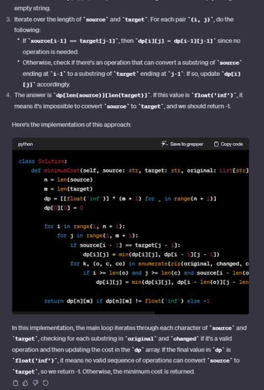
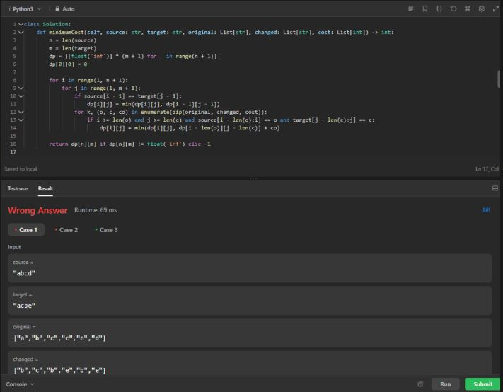
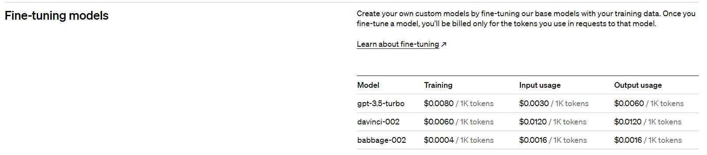

# LLM Fine Tuning

## Context
chatGPT is good at solving D&A-type problems, but not the hard ones.

If we take the latest problems that come out, for example, the latest hard problem released on LeetCode as I write these lines:

## Attempted Solution
When asked to solve it, the answer given is wrong. Below are the images of the attempted solution:

  
  

 

## The Idea
The goal is to design a more efficient model for code questions.

## Project Goal
My aim is to create a browser extension, in which you can copy and paste a DSA (Data Structure and Algorithm) type question, and the extension will provide the answer to the question.

---

## My Work / Research

### First step

At first, I thought I'd use a model that had already been made and finetuned on huggingface to see what results could be obtained. 

Unfortunately, I ran into a problem:
**Canceled future for execute_request message before replies were done**

**The Kernel froze when executing code in the active cell or a previous cell. Please check the code in the cell(s) to identify a possible cause of the failure. Click [here](https://aka.ms/vscodeJupyterKernelCrash) for more information. For more information, see Jupyter log.**

In other words: I don't have enough memory to run the model on my computer, even taking the model with the fewest parameters and trying with colab,, the models used 7B of data and are too heavy.

### New idea

Two solutions: pay google colab pro (no thanks), or think again.

On second thought, I found a provider that, I think, hosts the models on their servers, and with the help of an API lets us interact with them and even finetune them. Advantage: Free plan $5

Disadvantage: I invite you to read version1.ipynb to understand that the results weren't convincing.

### Hand to wallet

And if the solution could be found in our dear friend openAI.

  

1,000 tokens is about 750 words

Using ChatGPT, I told him to create a solution for the first 5 leetcode exos and to count the average number of characters, and he came up with 365.75 characters (counting spaces, of course).
we can add the fact that there's a little sentence before talking about the datastructure used and a little sentence after, talking about time and space complexity.

Let's round up the total output to an average of 400 characters.

For the input, it varies according to the statement. If we do as above and take the first 5 leetcode exos, we get : 200 characters on average for input.

If we consider that, on average, one token = 4 characters.

We'll have :

- for input: 200 characters --> 50 tokens
- for output: 400 characters --> 100 tokens
- For training: input + output = 600 characters --> 150 tokens

According to training prices, for GPT-3.5-turbo :

For 
0.0080 = 1000 tokens
1000 raw of data = 150000 tokens

so if I want to enter 1000 examples of exercises, it will cost me: 0.0080 * 150 = 1.2$.

the cost of then testing the model with a few exercises will be lower: if I do fifteen or so tests, it will cost me less than 1000 tokens, i.e. less than $0.008.

The main cost is in training.

## Davinci-002 or GPT-3.5-turbo

> Davinci-002 tends to be better at understanding and generating responses for complex tasks. It has been trained on a wider variety of data and for longer, allowing it to develop a deeper understanding of nuanced prompts.
> GPT-3.5-turbo is designed for more rapid responses and may not perform as well on highly complex tasks.

Code-Related Tasks:

> For generating code and solving programming-related queries, Davinci-002 is typically superior. It's been shown to have a better grasp of syntax and logic required for programming, which would be beneficial for solving hard LeetCode problems.
> While GPT-3.5-turbo can handle code to some extent, it might not be as precise or efficient as Davinci-002 when dealing with more complex or less common problems.

I will go for Davinci-002